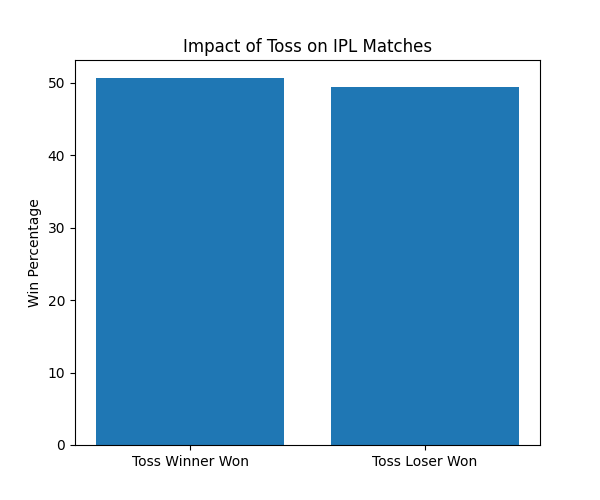
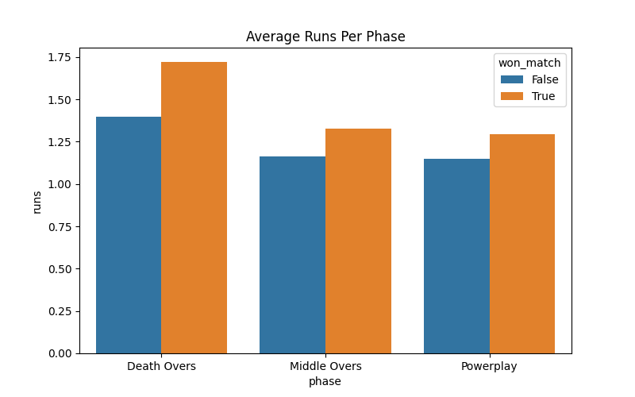

# IPL Match Analytics

## Questions Solved

- Does toss affect winning?
- Which phase matters most?
- Top players across seasons

## Tools Used

- Python
- Pandas
- Matplotlib
- Seaborn

## Key Insight

Death overs had the strongest relationship with match victories.

## Charts

### Toss Analysis

### Phase Analysis

